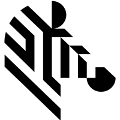

<!-- PROJECT LOGO -->
 

  

# Titan Dashboard
This is a visual dashboard for TUSC fixtures in the Zebra Holtsville office.

## Zebra Team:  
This is for the DCS T&V Automation Group.

## Zebra Confidential and Proprietary Statement:

This source code repository contains Zebra Technologies Corporation’s confidential information that 
is protected by Zebra’s intellectual property rights, including trade secret law and copyrights. Zebra 
derives significant commercial value from the confidentiality of the code in this repository, and any 
public exposure of the code is a breach of your employment obligations or your contract with Zebra as 
a vendor. By accessing this repository you agree to protect the code in accordance with Zebra’s trade 
secret protection policy or your obligations of confidentiality as a contractor. You will not store 
the code in a non-approved Zebra Version Control System (VCS) or non-approved Zebra source code 
location, or other public or private source code repository, by performing a clone, check-out, fork, 
push, check-in or any other similar action. All access is monitored and logged.  

Unauthorized access, copying or sharing of any code stored on this site is prohibited and 
will be prosecuted.

